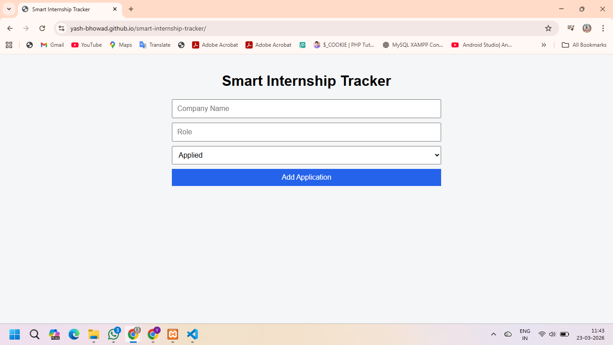
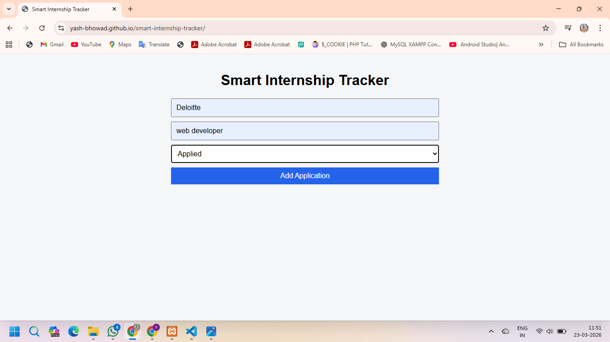
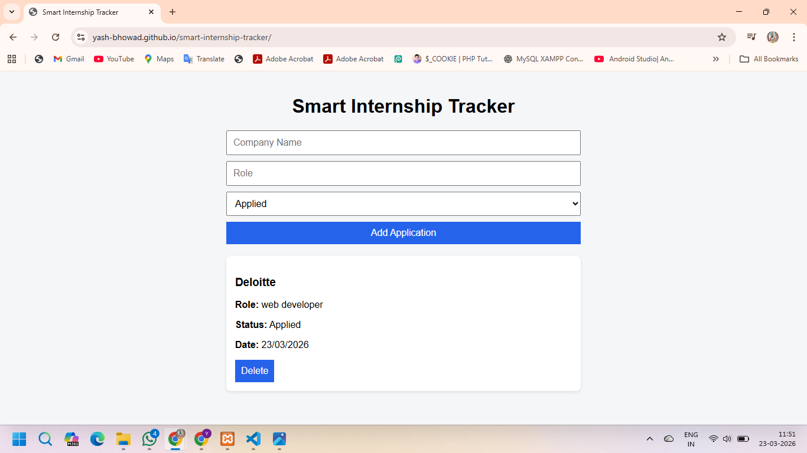

# Smart Internship Tracker

A simple and user-friendly web application to track internship applications and manage their status efficiently.

## 🚀 Features
- Add internship details (Company Name, Role, Status)
- Track application status (Applied, Interview, Selected, Rejected)
- Automatically stores data in browser (Local Storage)
- Delete applications easily
- Clean and responsive user interface

## 🛠 Tech Stack
- HTML
- CSS
- JavaScript

## 🌐 Live Demo
👉 https://yash-bhowad.github.io/smart-internship-tracker/

## 📸 Screenshots

### 🏠 Home Page

### ➕ Add Internship

### 📋 Application List

## 📂 How to Run Locally
1. Download or clone this repository  
2. Open `index.html` in your browser  

## 💡 Future Improvements
- Edit/update application feature  
- Filter by status  
- Backend integration (PHP & MySQL)  

## 👨‍💻 Author
**Yash Bhowad**
